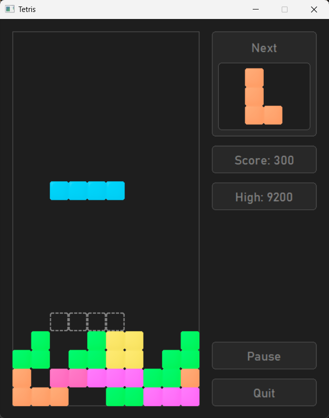
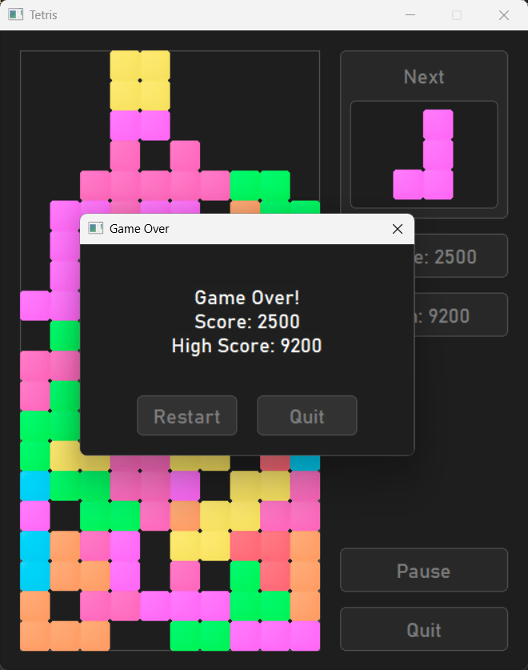

# Tetris Game (C++ & WinAPI)
This is a simple Tetris game written in C++ using WinAPI and GDI+. 

## Features
- Smooth rendering with double buffering
- Custom UI elements (buttons, Game Over screen)
- Resource management system
- High-score saving system

## Controls
- ← → : Move piece
- ↑ : Rotate
- ↓ : Soft drop
- Space : Hard drop

## How to build
1. Install CMake and Visual Studio
2. Build:
	```bash
	   cmake -B build
	   cmake --build build --config Release
3. Run `build/bin/Release/TetrisGame.exe`



